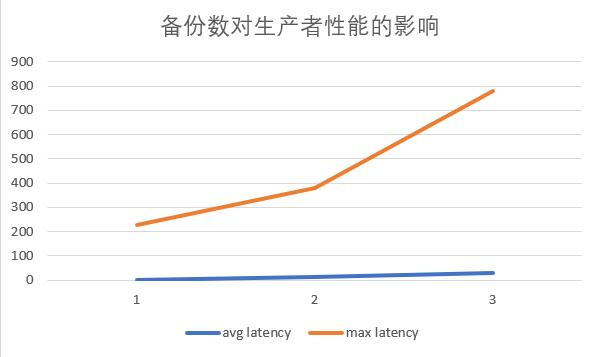

## 网络及存储设置
### 网络测试
#### Test1
    使用www.speedtest.cn的在线测试工具对ping, upload, download, jitter进行测试
    测试结果如下
| - | 1 | 2 | 3 | avg |  
| :-:  | :-: | :-: | :-: | :-: |
|Ping|152.78|71.92|505.13|243.28|
|Download|74.17|93.56|94.65|87.46|
|Upload|69.32|99.74|100.15|89.74|
|Jitter|360.26|2.22|3476.76|1279.3|  
    使用了上海节点，但是显然测试结果很不稳定  

#### Test2
    使用www.speedtest.net的在线测试工具对ping, upload, download, jitter进行测试  
    结果如下
| - | 1 | 2 | 3 | avg |  
| :-:  | :-: | :-: | :-: | :-: |
|Ping|5|5|5|5|
|Download|92.33|92.11|92.75|92.34|
|Upload|91.45|92.41|90.85|91.57|
    结果比较稳定，虽然没有jitter的参数但是看速度曲线变化较小

### 存储测试
    使用windows内置的winsat disk进行性能测试
    测试结果如下
| - | 1 | 2 | 3 | avg |
| :-: | :-: | :-: | :-: | :-: |
| Random 16 Read | 153.18 | 164.52 | 160.62 | 159.44 |
| Sequential 64 Read | 369.54 | 362.06 | 386.37 | 372.65 |
| Sequential 64 Write | 513.62 | 513.93 | 513.73 | 513.76 |
| Delay 95% | 0.151 | 0.162 | 0.180 | 0.164 |
| Max Delay | 22.267 | 26.416 | 18.925 | 22.536 |


# Part C: Design an experiment to quantitive analyzing

## Test tool: kafka官方提供的kafka-perf工具
## 生产者测试 kafka-producer-perf-test参数说明

| 参数 | 说明 |
| --------------- | ------------- |
| topic | topic名称 |
| num-records | 发送的消息数 |
| record-size |每个记录的字节数 |
| throughput | 每秒钟发送的记录数 |
| producer-props | 生产者的配置信息 |
| threads | 生产者使用几个线程同时发送 |

--------------------- 
测试1: 50w条消息，每条消息大小1000，自变量为throughput，查看性能变化。

```bash
>kafka-topics.bat --create --zookeeper localhost:2181 --topic test1 --partitions 3 --replication-factor 1
```
throughput = 10000 命令行与结果：
```bash
>kafka-producer-perf-test.bat --num-records 500000 --record-size 1000 --topic test1 --throughput 10000 --producer-props bootstrap.servers=*.*.*.*:9092
```
> 500000 records sent, 9998.800144 records/sec (9.54 MB/sec), 50.58 ms avg latency, 1662.00 ms max latency, 0 ms 50th, 404 ms 95th, 1278 ms 99th, 1617 ms 99.9th.

throughput = 20000：

> 500000 records sent, 19997.600288 records/sec (19.07 MB/sec), 57.52 ms avg latency, 1397.00 ms max latency, 0 ms 50th, 420 ms 95th, 1207 ms 99th, 1378 ms 99.9th.

throughput = 40000：

> 500000 records sent, 39987.204095 records/sec (38.13 MB/sec), 69.71 ms avg latency, 776.00 ms max latency, 1 ms 50th, 541 ms 95th, 721 ms 99th, 766 ms 99.9th.

throughput = 100000:
> 500000 records sent, 89158.345221 records/sec (85.03 MB/sec), 222.05 ms avg latency, 666.00 ms max latency, 210 ms 50th, 604 ms 95th, 656 ms 99th, 664 ms 99.9th.

| num-record | record-size | messages/sec | MB/sec | avg latency | max latency |
|----|----|----|----|----|----|
|500000|1000|10000|9.54|50.58|1662.00|
|500000|1000|20000|19.07|57.52|1397.00|
|500000|1000|40000|38.13|69.71|776.00|
|500000|1000|100000|85.03|222.05|666.00|

测试2: 消息量与throughput不变，自变量为分区数partition。

> replica = 1, num-record = 50w, record-size = 1000,  throughput = 20000

| partition | avg latency | max latency |
|---|---|---|
|1|1.19|162.00|
|3|28.03|1049.00|
|6|43.33|1091.00|

 


测试3：自变量为备份数。

```bash
>kafka-topics.bat --create --zookeeper localhost:2181,59.78.46.195:2181,59.78.46.196:2181 --topic test4 --partitions 3 --replication-factor 3
Created topic "test4".
>kafka-topics.bat --create --zookeeper localhost:2181,59.78.46.195:2181 --topic test5 --partitions 3 --replication-factor 2
Created topic "test5".
>kafka-topics.bat --create --zookeeper localhost:2181 --topic test6 --partitions 3 --replication-factor 1
Created topic "test6".
```

| broker | avg latency | max latency |
|--|--|--|
|1|2.26|229|
|2|12.19|380|
|3|29.12|779|

 

## 生产者性能测试结果分析
- throughput与每秒生产量成正比，随着throughput增长，虽然平均latency会相应增长，但吞吐量正比上升，max latency逐渐减小。
- 吞吐量一定，分区数越大，生产者的延迟时间越长，但趋势并不成正比。
- 吞吐量一定，备份数越多，生产者延迟时间越长，性能越差。
- throughput数、分区数、broker数几个因素中，broker数量对性能影响相对最大。 
--------------------- 
## 消费者测试 kafka-consumer-perf-test参数说明

| 参数 | 说明 |
| --------------- | ------------- |
| topic | topic名称 |
| fetch-size | 指定每次fetch的数据的大小 |
| messages | 消费的消息个数 |
| num-fetch-threads| fetch的线程数 |
| threads | 线程数 |


测试1： threads作为自变量

 

 |threads|rebalance time(ms)| fetch time(ms)|fetch MB/ms|
 |--|--|--|--|--|
 |1|81|39251|12|
 |5|100|39796|11|
 |10|107|46204|10|

 测试2：fetch-size作为自变量

 测试3：num-fetch-thread作为自变量

## 消费者性能测试结果分析
- 增大fetch-size和fetch-threads对提升吞吐量有效。
- 在本实验中分区为6的情况下threads的改变对消费者影响不大，可能需要进一步增大分区和线程进行测试，得出更准确的结论。
- replication-factor对consumer的吞吐量影响不大，因为consumer只会从每个partition的leader读数据，与生产者方面的参数replicaiton factor、同步等无关。

## Setup Kafka cluster

### 在三台服务器上，修改各自的kafka配置文件server.properties
- 各自不同的broker-id

 

- 在zookeeper.connect添加其它服务器的host:port

 

## Related Command line
### 1. 启动 Zookeeper 并启动 Kafka
```bash
kafka_2.12-2.0.0>"./bin/windows/kafka-server-start" "./config/server.properties"
```
### 2. Create a topic and Run Producer
```bash
bin\windows>kafka-topics.bat --create --zookeeper localhost:2181 --replication-factor 1 --partitions 1 --topic test
bin\windows>kafka-console-producer.bat --broker-list localhost:9092,server1:9092,server2:9092 --topic test
```
### 3. Run Consumer
```bash
\bin\windows>kafka-console-consumer.bat --bootstrap-server localhost:9092 --topic test --from-beginning
```
### 4. Run Consumer test
```bash
>kafka-consumer-perf-test --topic test7 --fetch-size 10 --broker-list localhost:9092 --messages 50000
```


